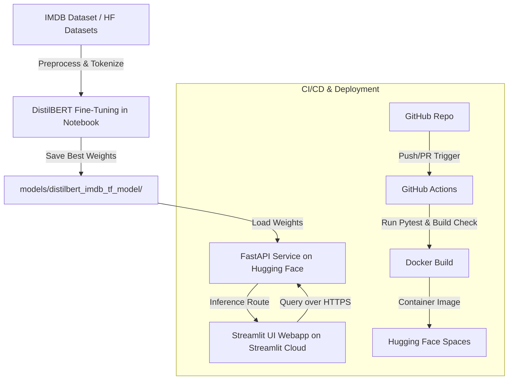

# End-to-End Movie Review Sentiment Analysis with MLOps

A production-ready, end-to-end MLOps pipeline for movie review sentiment classification. The project fine-tunes a **DistilBERT** model on movie reviews using a Jupyter notebook, serves predictions via a **FastAPI** REST interface, and provides a polished **Streamlit** frontend. The entire stack is containerized with **Docker** and automated using **GitHub Actions CI/CD**.

---

## System Architecture



---

## Folder Structure

```
movie-sentiment-mlops/
│
├── .github/
│   └── workflows/
│       └── ci_cd.yml          # GitHub Actions CI/CD automation workflow
│
├── api/
│   ├── main.py                # FastAPI main entrypoint and middleware logging
│   ├── inference.py           # Thread-safe model predictor singleton wrapper
│   └── schemas.py             # Pydantic request/response validation schemas
│
├── app/
│   └── app.py                 # Streamlit UI web interface
│
├── data/                      # Local data cache folder (created dynamically)
│
├── models/
│   └── distilbert_imdb_tf_model/    # Local save path for best fine-tuned model checkpoint
│
├── notebooks/
│   └── DistilBert_Transformer.ipynb # Jupyter notebook showcasing pipelines
│
├── src/
│   ├── config.py              # Central hyperparameters and file path configurations
│   ├── predict.py             # Predictor wrapper class with CPU/GPU support
│   └── utils.py               # Structured logging configurations & seed initializers
│
├── tests/
│   ├── test_api.py            # FastAPI integration client tests
│   └── test_inference.py      # Predictor module unit tests
│
├── Dockerfile                 # Multi-stage optimized Docker setup
├── docker-compose.yml         # Container coordinator (FastAPI, Streamlit)
├── requirements.txt           # Python packages pin list
├── setup.py                   # Python package setup for editable installations
└── README.md                  # System documentation
```

---

## Local Quickstart Setup

### Prerequisites
* Python 3.11
* Docker & Docker Compose (Optional)

### 1. Set Up Virtual Environment & Packages
First, clone this repository and create a virtual environment:
```bash
# Create virtual environment
python -m venv .venv

# Activate virtual environment
# On Windows:
.venv\Scripts\activate
# On Linux/macOS:
source .venv/bin/activate

# Install dependencies and editable package
pip install --upgrade pip
pip install -r requirements.txt
pip install -e .
```

### 2. Model Training (Jupyter Notebook)
The model training is done interactively within a Jupyter Notebook rather than through a separate script.
1. Open the notebook at `notebooks/DistilBert_Transformer.ipynb`.
2. Run all the cells to load the IMDB dataset, initialize the tokenizer and model, and train.
3. The final cell will save the fine-tuned model weights and tokenizer directly into `models/distilbert_imdb_tf_model/`.

---

## API Service Documentation (FastAPI)

Start the FastAPI application locally:
```bash
uvicorn api.main:app --host 127.0.0.1 --port 8000 --reload
```
Access the interactive API documentation at: `http://127.0.0.1:8000/docs`

### 1. API Healthcheck
* **Endpoint**: `GET /`
* **Response**:
  ```json
  {
    "status": "running",
    "model": "DistilBERT Sentiment Classifier"
  }
  ```

### 2. Model Prediction
* **Endpoint**: `POST /predict`
* **Request Payload**:
  ```json
  {
    "text": "This movie was absolutely fantastic. The acting was superb!"
  }
  ```
* **Response Payload**:
  ```json
  {
    "sentiment": "Positive",
    "confidence": 0.9934
  }
  ```
* **cURL command**:
  ```bash
  curl -X POST "http://127.0.0.1:8000/predict" \
       -H "Content-Type: application/json" \
       -d "{\"text\": \"This movie was a terrible waste of time.\"}"
  ```

---

## Streamlit Web Interface

To launch the interactive dashboard, run:
```bash
streamlit run app/app.py
```
This launches a browser tab at `http://localhost:8501`. Features include:
* **Interactive Text Input**: Write or copy movie reviews.
* **Graphical Confidence Meters**: Visual progress bars mapping sentiment probability.
* **Recent Predictions**: Lists previous evaluations in a session-state tracker.
* **Dynamic API Health Checks**: Live status indicators monitoring the FastAPI backend.

---

## Docker Deployment

You can build and deploy the entire multi-service container system in one click.

### Build and Run with Docker Compose
```bash
# Build and run API and Streamlit UI Frontend
docker-compose up --build
```
Once started, the services map to the following local ports:
* **FastAPI Service**: `http://localhost:8000`
* **Streamlit UI Frontend**: `http://localhost:8501`

### Run API standalone via Dockerfile
```bash
# Build standalone image
docker build -t movie-sentiment-mlops .

# Run container exposing port 8000
docker run -p 8000:8000 movie-sentiment-mlops
```

---

## Testing Suite

We use `pytest` for unit and integration testing. Run:
```bash
pytest tests/ -v
```
The test suite validates:
* **Inference**: Predictor boundary scores, empty text handling, and list batch prediction methods.
* **API Endpoints**: Correct GET `/` responses, POST `/predict` status checks, and Pydantic validation error code mappings (422/400).

---

## Production Cloud Architecture

For cloud deployments, follow this MLOps topology:
1. **GitHub Repository**: Holds the source code and configuration.
2. **GitHub Actions**: Runs code linting, executes pytest (pulling weights via Git LFS), and verifies Docker builds.
3. **FastAPI Web Service**: Deployed on **Hugging Face Spaces** using the `Dockerfile`, pulling the tracked LFS model weights.
4. **Streamlit UI**: Deployed on **Streamlit Community Cloud**, querying the public Hugging Face Spaces FastAPI endpoint over HTTPS.
